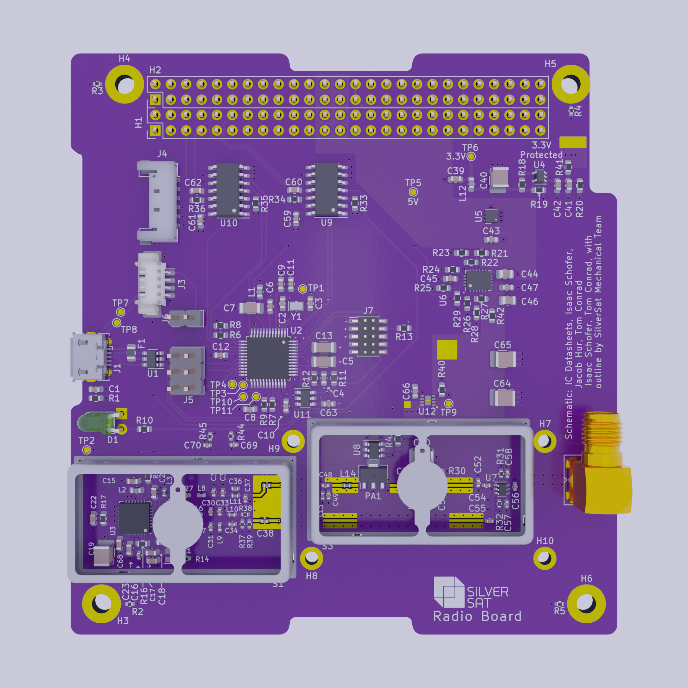

# Radio_Board
SilverSat Limited – https://silversat.org

The unassembled radio board (front view)

CGI top board view. _Reference image from 2022-08-24. Actual board may vary._

SilverSat's Radio Board is a custom-designed Adafruit Metro and Arduino® compatible controller with an integrated 1-watt digital radio transceiver. It serves as an Internet gateway that connects our Avionics and Payload boards to the Internet through a ground station. It can also control one of each an [Endurosat Antenna Board](https://www.endurosat.com/cubesat-store/cubesat-antennas/uhf-antenna/) and [1U solar panel](https://www.endurosat.com/cubesat-store/cubesat-solar-panels/1u-solar-panel-z/).

This repository contains the board design in KiCad 6.0, PDF, and various 3D formats. It also contains bills of materials, relevant component datasheets, and a thermal model in a Microsoft® Excel scpreadsheet.

# Setup
1. If you haven't already done so, download and install KiCad 6.0 from their website, https://www.kicad.org/download/. Depending on your system and Internet connection, than may take several hours.
2. On the top right of the repsitory's main page, click “Code” to select download options. On all operating systems, you can download and extract a ZIP archive to your perrfered folder. Alternatively, you can use one of the many free Git access programs available from the Internet. Here are instructions for a few common programs.
   * On Windows and Mac, you can download and install GitHub Desktop (https://desktop.github.com/) to access and manage Git repositories. See https://docs.github.com/en/desktop/contributing-and-collaborating-using-github-desktop/adding-and-cloning-repositories/cloning-a-repository-from-github-to-github-desktop for details.
   * There are also many command line interfaces available. For example, GitHub offers `gh` which can be downloaded from their repository (https://github.com/cli/cli). Once you install the client, navigate to your perferred folder and run the command given by our repository's Code tab.
   * On Unix and Linux, many software repositories offer `git` as an alternative to `gh`. You can download and install `git` from your package manager.
     - Debian-based Linux: `sudo apt install git`
     - RedHat Linux or derivatives: `sudo yum install git`
     - macOS (using [Homebrew](https://github.com/Homebrew/brew)): `brew install git`
   * For other programs, see their associated documentation for directions.
3. Download and install SilverSat's KiCad Library (https://github.com/silver-sat/kicad_library). Installation instructions are given on the library's README.md.
   - It is possible to skip this step, but some parts (such as the TCXO) may fail to load.¹
5. Enter the project folder and open SilverSat_Comms.kicad_pro. KiCad will show options to edit the schematic or PCB.

# Files
| File name                 | Description                                                                              |
| ------------------------- | ---------------------------------------------------------------------------------------- |
| Arduino_Board_Definitions/| Arduino-compatible board definitions for upcoming code				       |
| bom/ibom.html		    | Bill of Materials, in HTML format, generated by [InteractiveHtmlBom](https://github.com/openscopeproject/InteractiveHtmlBom) |
| board3D/                  | 3D board model, in various formats.                                                      |
| Datasheets/               | Datasheets for used parts                                                                |
| doc/			    | Documentation folder (in-progress as of 2022-08-20 UTC)				       |
| gerbers/		    | PCB in standard Gerber format							       |
| packages3D/		    | Custom 3D models added where missing in our KiCad libraries			       |
| .git/ 		    | Internal Git folder (hidden on Unix/Linux systems)				       |
| .gitignore                | Tells Git not to add specified file types to the repository                              |
| AX5043.kicad_prl          | _Description missing_                                                                    |
| AX5043.kicad_sch          | Clone of OnSemi's ADD5043-433-GEVK evaluation board for the AX5043                       |
| AX5043.kicad_xml          | _Description missing_                                                                    |
| fp-info-cache		    | _Description missing_                                                                    |
| HTMLBOM.xlsx		    | Bill of materials	in Microsoft® Excel™ format					       |
| PASwitch.kicad_sch        | Power amplifier and Tx/Rx switch schematic                                               |
| PAPowerSwitch.kicad_sch   | Electronically-controlled power switch, connected to the RF amplifier		       |
| PATempSensor.kicad_sch    | Schematic for the power amplifier's temperature sensor                                   |
| PDF_schematics.pdf	    | All KiCad schematics, printed to PDF (except top-level schematic)			       |
| README.md                 | This file                                                                                |
| SAMD21.kicad_sch          | Schematic for an Arduino®-compatible computer, inspired by the Adafruit Metro M0 Express |
| serial_driver.kicad_sch   | Driver chips for header serial lines 	     	      	     	      	       	       |
| SilverSat_Comms	    | Bill of materials in CSV format							       |
| SilverSat_Comms.kicad_dru | Custom project design rules							       |
| SilverSat_Comms.kicad_pcb | The radio board's PCB layout                                                             |
| SilverSat_Comms.kicad_prl | _Description missing_                                                                    |
| SilverSat_Comms.kicad_pro | The main KiCad project file, which can be used to access all other files                 |
| SilverSat_Comms.kicad_sch | The project's top-level schematic.                                                       |
| SilverSat_Comms.png       | A 3D computer-generated top view of the board                                            |
| SilverSat_Comms.step	    | 3D model of the board in STEP format for CAD software				       |
| SilverSat_Comms.xml	    | Hierarchial sheet layout and KiCad-format BOM in XML				       |
| SilverSat_Comms-cache.lib | Presumably KiCad's project cache                                                         |
| SilverSat Comms (Radio) Board.settings.json| _Description missing_                                                   |
| eFuse3V3.kicad_sch        | 3.3 volt e-fuse schematic                                                                |
| eFuse5V.kicad_sch         | 5 volt e-fuse schematic                                                                  |
| externalwatchdog.kicad_sch| Watchdog timer schematic                                                                |
| pi_net.kicad_sch          | Unbalanced Pi Matching Network (KiCad schematic)                                         |
| pi_net.m                  | Unbalanced Pi Matching Network (MATLAB®² script)                                         |
| serial_driver.kicad_sch   | Serial port driver schematic                                                             |
| sym-lib-table             | Table of KiCad symbol libraries                                                          |

## Known Issues
- KiCad 6, required by our project, is not supported on Windows 7 or earlier releases. We have not yet tested Windows 8.
- It is possible that Windows users of KiCad versions 6.0.0 to 6.0.4 may experience issues with sudden component changes using using the Edit Schematic Fields tool.
- When adding, removing, or moving components in the schematic, importing the changes into the PCB may cause components to change places. Although they can be moved back in place, it is easier to preserve annotations (or, if you add a component, manually annnotate it).
- Due to the large size of this repository, it may download slowly depending on your connection speed. On a 5 Mb/s connection, this time is approximately 12 minutes and 43.2 seconds.
   * To reduce disk space after downloading, delete the hidden .git folder by showing hidden files in your browser, or (on Unix or Linux) typing `cd path/to/Radio_Board/ && rm -r .git/` in the terminal. However, this will remove Git tracking from your local folder.

# Warnings
This board was designed for the [OshPark 4-Layer PCB Service](https://docs.oshpark.com/services/four-layer/). Using another board type or service will require adjustments to the RF amplifier lines and may require other appropriate compensations.

# Notes
¹ We have not yet tested whether this will work, but we presume based on past experience that the resulting error can be ignored.  
² All trademarks (®) are property of their respective owners.