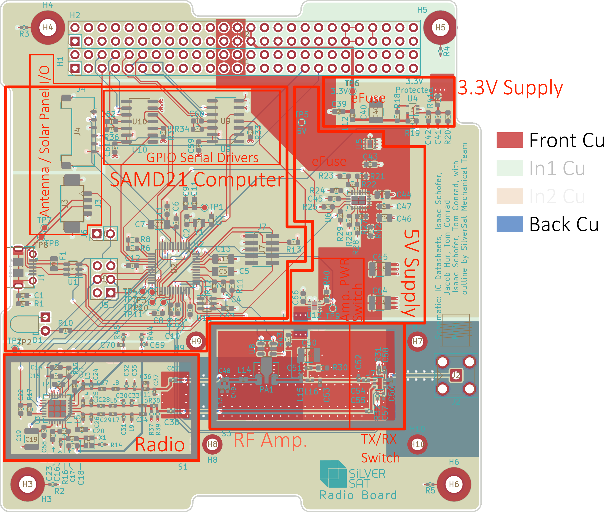

Radio Board Layout
---
SilverSat Ltd. (https://silversat.org)
2022-08-20

During the design process, the board was layed out in sections to ease part placement, and it could be referenced to during testing. In this document, we present the board sections and state their meanings.

_Figure 1: Board layout_

# SAMD21
The SAMD21 is an approximately 48 MHz SAMD21-based processor inspired by the [Adafruit Metro M0 Express](https://www.adafruit.com/product/3505). It is compatible with the Metro and the Arduino Zero with modified serial pin definitions (TBD: Add). Most of the connections are hard-wired in the board, but a spare UART port is available on TP10 (TX) and TP11 (RX).

## Pinouts

## J1
USB Mini B (limited to 0.3 A)

### J3
Modified USB (for solar panel data as a backup for other boards)

### J4
[Endurosat Antenna Board](https://www.endurosat.com/cubesat-store/cubesat-antennas/uhf-antenna/) data connector

### J5
| MISO  | 3.3 V |
| ----- |------ |
| SCK   | MOSI  |
| RESET | GND   |

### J6
|  GND  | RESET |
| ----- | ----- |

### J7 (SWD Header)
| 3.3 V       | RX LED SWDIO |
| ----------- | ------------ |
| GND         | SWCLK        |
| GND         | NC           |
| NC          | NC           |
| NC          | RESET        |

# Radio
The radio is a clone of the OnSemi ADD5043-433-GEVK (./Datasheets/ADD5043-433-2-GEVK SCHEMATIC.PDF) AX5043 test board schematic, placed in a two-piece RF shield. See https://docs.google.com/spreadsheets/d/1p7g6bLbYMMpFN-4EpKS5jOUkZsmeDw4OGFsxyWDDAP4/edit?usp=sharing for chip selection.

## Attenuator
The receive line (closest to the SAMD21) has a pi-attenuator network near the exposed ground test point. The BOM includes parts for 0 dB attenuation, but other values can be calculated using KiCad's PCB Calculator. Common values are also given in the schematic.

# Power Amplifier & TX/RX Switch
This circuit, based on a HMC452ST89, increases the transmit power from the radio from 16 dBm to 30 dBm.

To allow one connector to serve as transmit and receive, an TX/RX switch has been included.

# Serial Drivers
Converts differential serial lines from Avionics and Payload to UART for the SAMD21.

# Power Supplies
The board includes two power supplies (5V and 3.3V) which take DC power from SilverSat's Power board and applies latch-up protection and e-fuses.
## 5V
The five volt supply is almost entirely contained on the top layer, and powers the RF amplifier. In addition to the above, it includes and electronic power switch to power off the amplifier when it is not in use.

## 3.3V
The output connects to a power plane on the In_2 copper layer, powering the SAMD21, ADD5043 and TX/RX switch.
